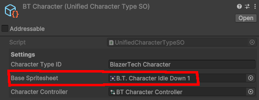
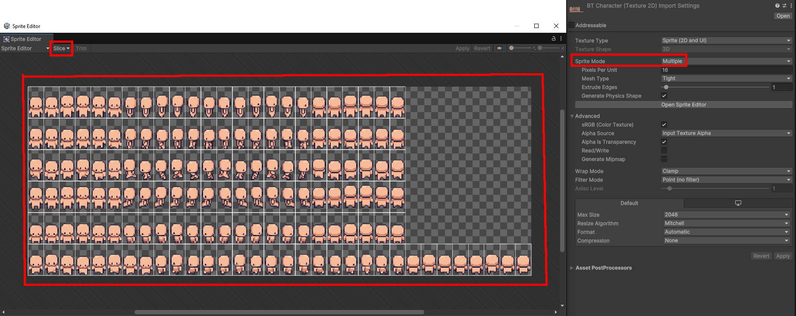

# Base Spritesheet
  
The default Spritesheet used for a Character Type.

Set this Spritesheets `Sprite Mode` to `Multiple` and slice it.
Anytime a character is used this Spritesheet will be used, a shader will then override it to show the finalized character.

