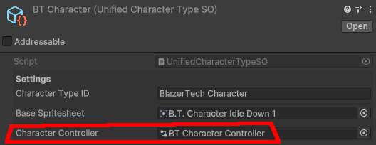

# Character Controller

The `Character Controller` is the `Animator Controller` that all characters of the same Character Type will use. You can set it up however you want for your game. The only requirement is all sprites used in the animations within the Animator Controller must be sprites from the [Base Character Spritesheet][base-spritesheet]