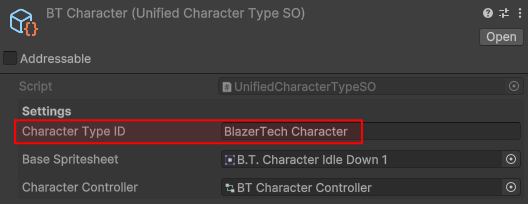

# Character Type ID
  
The Character Type ID is a unique identifier for a Character Type and is **`Required`**.

!!! Warning
    If a Character Type ID is either not set or is the same as another Character Type, the Character Type will be invalid!
