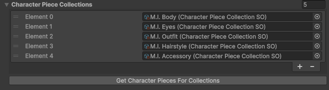

# Layered Character Type

`LayeredCharacterTypeSO` Inherits from [CharacterTypeBaseSO](character-type-base.md).

!!! Note
    Layered Character Types must be placed inside a Resources folder in order to be valid!

---

## Base Character Type Fields

| Fields                | Description|
|-----------------------|-----------:|
| [Character Type ID][character-type-id]       | A **Unique** Identifer
| [Base Spritesheet][base-spritesheet]         | The default character spritesheet
| [Character Controller][character-controller] | The Animator Controller used

---

## Character Creator Settings `(Unfinished)`
| Fields                | Description|
|-----------------------|-----------:|
| Use Clean Character Piece Names       | Replaces `underscores` with `spaces` when display Character Piece Names
| Character Preview Controller          | The Animator Controller to use when previewing a character in the Character Creator
| Character Placeholder Sprite          | Default sprite to show representing this Character Type
| Base Character Piece Collection       | Default Character Piece Collection to be used

---

## Character Piece Collections
A list of Character Piece Collections

