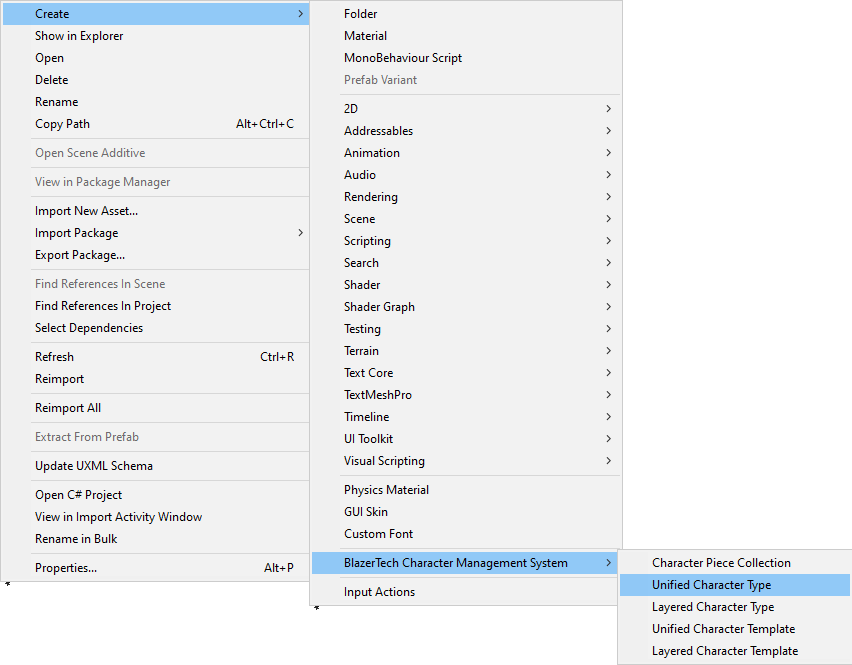

# Unified Character Type
To create a Unified Character Type right click the **Project** window and navigate to **Create > BlazerTech Character Management System > Unfied Character Type**

---

No new fields have been included. refer to [Character Type Base](character-type-base.md)