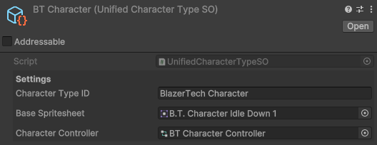

# Unified Character Type

The Unified Character Type Inherits from [CharacterTypeBaseSO](character-type-base.md)  

## test

## Creating a New Unifed Character Type

To create a Unified Character Type right click the **Project** window and navigate to  
 **`Create > BlazerTech Character Management System > Unified Character Type`**

---
## Unified Character Type Fields

| Fields                | Description|
|-----------------------|-----------:|
| [Character Type ID](character-type-fields/character-type-id.md)     | A **Unique** Identifer
| Base Spritesheet                                                    | The default character spritesheet
| Character Controller                                                | The Animator Controller used

<!-- All required fields are from the base class. No new ones are added. -->

Link to [Hello, World!](#test)